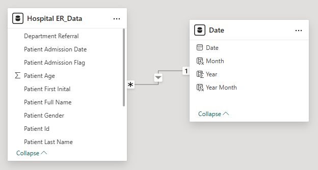

# ER_analysis
### Project Overview
The ER Hospital Analysis dashboard monitors key hospital emergency room metrics on a month-to-month basis.  
The goal of this project is to identify operational patterns, patient demographics, and service efficiency to support data-driven improvements in emergency department performance.

### Business Requirement
Monitor key ER performance metrics and trends monthly to identify:
- Patient admission patterns
- Demographic distribution
- Department referrals
- Service timeliness
- Operational efficiency

### Data Transformation
Data cleaning and transformation were performed before analysis.

### Create Date Table
Date = CALENDAR(
MIN('Hospital ER_Data'[Patient Admission Date]),
MAX('Hospital ER_Data'[Patient Admission Date])
)
Year = YEAR('Date'[Date])  
Month = FORMAT('Date'[Date], "mmm")  
Year = YEAR('Date'[Date])  
Year Month = FORMAT('Date'[Date], "YYYY-MM")  
**Patient Full Name**

### Dataset
The primary fact table contains detailed ER patient records including Patient ID, admission date, demographics, department referrals, wait time, admission status, and satisfaction scores.
## Dataset

### Primary Fact Table
The primary fact table contains detailed ER patient records capturing admissions, demographics, department referrals, wait times, admission status, and patient satisfaction.  

**Columns included in the fact table:**

| Column Name                   | Description |
|-------------------------------|-------------|
| Patient Id                     | Unique identifier for each patient |
| Patient Admission Date         | Date and time of ER admission |
| Patient First Initial          | First initial of the patient |
| Patient Last Name              | Last name of the patient |
| Patient Gender                 | Gender of the patient (Male, Female, Not Confirmed) |
| Patient Age                    | Age of the patient at time of admission |
| Patient Race                   | Racial demographic of the patient |
| Department Referral            | Department to which patient was referred |
| Patient Admission Flag         | Indicates whether patient was admitted (TRUE/FALSE) |
| Patient Satisfaction Score     | Satisfaction rating provided by patient |
| Patient Waittime               | Time (in minutes) patient waited before service |
| Patients CM                    | Custom metric (e.g., case management count) |
### Date Table
A separate DateTable is created as a date dimension to support time-based analysis with the following fields:
- Date
- Month
- Month Number
- Year

### Data Model Relationships
The data model follows a **star schema**, where the ER dataset acts as the central fact table and is connected to the **DateTable** through the **Patient Admission Date** field. This relationship enables efficient month-wise and year-wise analysis for building time-based visualizations and trends.

## Data Model Preview

